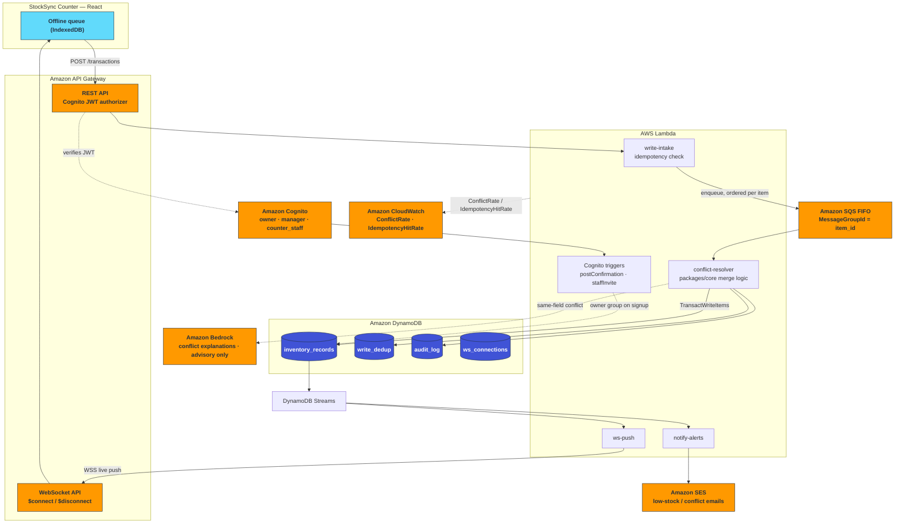

<div align="center">

# StockSync

**Inventory that never loses a sale — even offline.**

An offline-first inventory sync engine for kirana shops running more than
one billing counter on a single, often-unreliable internet connection.

[](https://github.com/Monolithic-Dev/stocksync/actions)
[](LICENSE)


[**Live demo**](https://main.d18ash44o1uc8d.amplifyapp.com) · [Demo video](#) · [Architecture](#architecture) · [Docs](docs/general/00-INDEX.md)

</div>

---

Two counters can sell the same item while both are offline, for any
duration, in any order — and when they reconnect, StockSync guarantees the
stock count reconciles to one mathematically correct, non-lossy state,
instead of one counter's sales silently overwriting the other's. It ships
with a minimal client, **StockSync Counter**, that exists to make the
engine's correctness demonstrable on screen, not to be a sellable
point-of-sale product.

> **Live demo:** https://main.d18ash44o1uc8d.amplifyapp.com
> — sign up to create a shop, or sign in to an existing one (shop identity
> comes from your Cognito account, not a URL query param); open a second
> window signed into the same shop to see the two-counter conflict scenario.
>
> **Demo video:** _TODO — add the recorded demo video link here._

## Contents

- [The problem, in one paragraph](#the-problem-in-one-paragraph)
- [Architecture](#architecture)
- [What makes this correct, not just working](#what-makes-this-correct-not-just-working)
- [Running it locally](#running-it-locally)
- [What we learned](#what-we-learned)
- [Project structure](#project-structure)
- [Scope](#scope)
- [Beyond the core sync engine — also shipped](#beyond-the-core-sync-engine--also-shipped)
- [Where this goes next](#where-this-goes-next)

## The problem, in one paragraph

Small Indian shops increasingly run more than one billing point — a
second counter during rush hours, or an owner checking stock from their
own phone — sharing one connection. Naive offline queuing lets both
counters record sales locally and, on reconnect, has whichever sync
lands last silently overwrite the other's numbers: one counter's sales
are effectively erased from the record. That's a real, recurring cost for
thin-margin retail — wrong stock counts cause late reordering or telling
a customer an item is available when it isn't. The fix isn't a better
network — it's a data structure that can merge two independent,
concurrent changes to the same shared number correctly, which is exactly
what a CRDT is built for. See [`docs/general/01-PRD.md`](docs/general/01-PRD.md)
§2 for the full problem statement.

## Architecture



The detail that matters most and is easiest to get wrong: **`MessageGroupId`
is the inventory item's ID, not the sending counter's ID.** Group by
counter instead, and two counters editing the same item race each other in
parallel Lambda invocations — which reintroduces the exact bug this
project exists to prevent.

## What makes this correct, not just working

Every one of these pieces is load-bearing, not decorative:

- **SQS FIFO, grouped by `item_id`** — guarantees every write touching a
  given item is processed strictly in order, regardless of which counter
  or how many counters sent it concurrently.
- **A PN-Counter CRDT for stock** — stock isn't an overwritable number,
  it's `base + increments − decrements`, so concurrent sales and restocks
  from different counters merge correctly regardless of arrival order.
- **Vector clocks** — detect whether an incoming write is a clean update
  or a genuine concurrent conflict with what's already stored.
- **Field-level merge** — disjoint concurrent field edits (e.g. price vs.
  shelf location) both apply; only a genuine same-field disagreement is
  ever flagged for a human, never silently guessed.
- **`TransactWriteItems`** — the record, its audit entry, and its
  idempotency claim update atomically, so a crash mid-write can never
  leave them inconsistent with each other.
- **Amazon Bedrock** — generates a plain-language explanation of a
  same-field conflict (e.g. two different prices set concurrently),
  purely advisory context for the human who resolves it, never the thing
  that decides the value.
- **CloudWatch** — custom `ConflictRate`/`IdempotencyHitRate` metrics
  plus queue-depth widgets, for the "we thought about operability" story.

Full design detail, including the exact algorithm and consistency model,
is in [`docs/general/02-ARCHITECTURE.md`](docs/general/02-ARCHITECTURE.md).
The rest of the doc set — database schema, API spec, edge-case catalog,
testing strategy — is indexed in
[`docs/general/00-INDEX.md`](docs/general/00-INDEX.md).

## Running it locally

```bash
npm install
npm run build

# API: local DynamoDB/SQS-backed dev server (no real AWS calls)
npm run dev:local-server --workspace=apps/api

# Web: the StockSync Counter client
npm run dev --workspace=apps/web

# Seed / reset the demo item set
npm run seed:demo
npm run reset:demo
```

Run everything with `npm test` / `npm run lint` / `npm run build` (via
Turborepo) at the repo root.

## What we learned

This project's core value was learning a few concepts by implementing
them against a real correctness requirement, not just reading about them:

- **Vector clocks and causal consistency** — used to decide, per item,
  whether an incoming write is a clean update or a genuine concurrent
  conflict, and why that's a weaker (and cheaper, and sufficient)
  guarantee than global linearizability.
- **CRDTs, specifically PN-Counters** — why a single overwritable stock
  number can't be made safe under concurrent offline edits, and why
  splitting increments/decrements into their own grow-only counters makes
  the merge provably commutative and associative.
- **DynamoDB Streams and `TransactWriteItems`** — Streams as a
  lightweight event-sourcing mechanism, and cross-table atomicity so a
  record update, its audit entry, and its idempotency claim can never
  drift out of sync with each other.
- **API Gateway WebSocket connection lifecycle** — `$connect`/
  `$disconnect` handling and cleaning up stale connections on a failed
  push, so a client that disconnected uncleanly doesn't accumulate as a
  silent failure.
- **Property-based testing** — proving the PN-Counter merge is
  commutative and associative across arbitrary operation orderings,
  rather than only asserting one example order works.

Two real bugs were found and fixed during a dedicated hardening pass
(Phase 9), documented in full in
[`docs/phases/phase-9-edge-case-status.md`](docs/phases/phase-9-edge-case-status.md):
a same-item write-ordering race in the intake batch handler, and a
server-computed `stock_anomaly` flag that was never actually surfaced to
the client.

## Project structure

- `packages/core` — the conflict-resolution engine (vector clocks,
  PN-Counter, field merge), framework-free TypeScript, testable without
  any AWS resource.
- `apps/api` — Lambda handlers and a local dev server that stands in for
  API Gateway/DynamoDB/SQS during development.
- `apps/web` — the StockSync Counter React client.
- `infra/cdk` — the AWS CDK stack defining every resource in the diagram
  above.
- `docs/general` — the full design doc set (start at `00-INDEX.md`).
- `docs/phases` — the phase-by-phase implementation plan this was built
  against.

## Scope

This build focuses entirely on the sync engine and the thin client that
proves it — not a full point-of-sale product. See
[`docs/general/01-PRD.md`](docs/general/01-PRD.md) §5 for exactly what's
in and out of scope, and §14/`docs/general/11-PHASED-SCOPE.md` for the
platform-layer roadmap (multi-tenant CRUD, checkout, analytics,
notifications, expanded AI features) beyond this core.

## Beyond the core sync engine — also shipped

The sync engine above is the hackathon-judged core. On top of it, this build
also ships a complete product layer:

- **Real Cognito authentication**, with owner/manager/counter_staff roles.
  Self-signup creates a shop and makes the signer its owner; owners invite
  managers and counter staff. Every API route sits behind a JWT authorizer,
  and `shop_id` always comes from the verified token, never the client.
- **An owner-facing analytics dashboard** — daily sales/revenue rollups and
  a trust-score headline metric that reframes the conflict rate as a
  business signal, not just an internal correctness number.
- **Low-stock and conflict-review email notifications** via Amazon SES,
  triggered off the same DynamoDB Streams the sync engine already writes to,
  sent to the shop's owner automatically.
- **Dark mode, toast notifications, and loading skeletons** across the
  whole client, for a UI that doesn't feel like a hackathon demo.
- Products/categories/suppliers CRUD and a checkout flow that reuses the
  exact same write-intake pipeline as a manual sale — see `19b` in
  [`docs/general/11-PHASED-SCOPE.md`](docs/general/11-PHASED-SCOPE.md).

## Where this goes next

Everything below is real, well-reasoned future scope we chose to name
rather than half-build under demo-day time pressure:

- **A verifiable credit history for shops that don't have one.** Most
  small Indian retailers run on cash and memory, with no formal record a
  lender could ever assess. StockSync's audit trail is, by construction,
  a timestamped, tamper-evident log of real transactions — not a lending
  product, but a far more honest starting point for creditworthiness
  than what most lenders can see about a shop like this today.
- **Collective demand signals across shops.** A single shop has no
  leverage with a supplier. If several nearby shops are all running low
  on the same item at once — which our per-shop analytics already
  detects — that's real aggregate demand worth a supplier's attention.
  We don't aggregate across shops today; doing it responsibly needs real
  design work (opt-in consent, no cross-shop data leakage), but the
  per-shop signal that would feed it already exists.
- **Cross-shop stock transfers**, where a transfer is simultaneously a
  decrement at the source and an increment at the destination, and both
  must stay atomic and conflict-safe even if both locations are offline
  at once — a genuinely hard extension of the same CRDT core, for a
  multi-location franchise.
- **Notifications beyond email** — SMS, or natively via WhatsApp (AWS End
  User Messaging Social) once Meta's template approval is in place.
- **A natural-language shop-query assistant** and **Bedrock-driven
  reorder alerts**, both grounded in real DynamoDB data, never a guess.
- **Voice-based transaction entry** for counter staff mid-rush.
- **QR "sneakernet" sync** — a device with zero connectivity (not just
  offline from the cloud) hands its queued transactions to a nearby
  connected device via a QR code, no pairing required. The most literal
  possible demonstration that origin and order don't matter to this
  engine, only the math does.
- **Computer-vision shelf reconciliation** — an optional photo-based
  stock estimate as a third, physical signal alongside what two devices
  claim, always advisory, never auto-correcting.
- **An icon-only, low-literacy UI mode** for counter operators who may
  not read fluently in any language.
- **Multi-environment CDK stacks** (dev/staging/prod) with a CI/CD
  approval gate.
